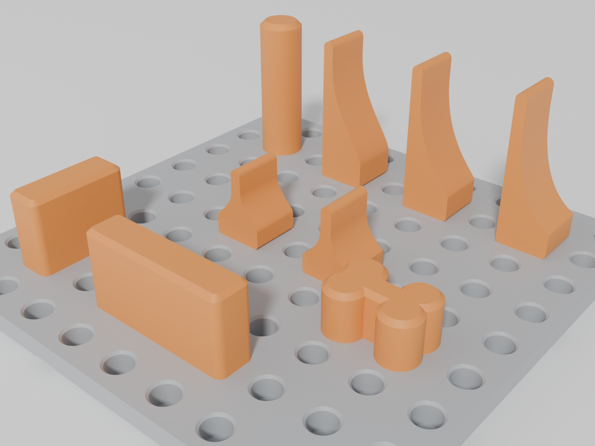

# GridDogs — parametric tool-anchor tiles for Gridfinity

**Pegboard tiles that drop into any Gridfinity baseplate, plus press-fit anchor pegs that
fence your tools in place.** Everything is generated from a single Python script, so every
dimension is customisable.



## The idea

GridDogs combines a pegboard-style tool-retention system with the standard Gridfinity
mounting interface:

- **Tiles** are pegboard plates with standard Gridfinity feet underneath — they drop
  straight into any Gridfinity baseplate, which gives X/Y registration for free.
- **Anchors** are press-fit pegged parts that plug into the tile holes to fence tools in.
  The name comes from woodworking bench dogs.

GridDogs is *inspired by* [GridLock](https://get.gridlocksystem.com) and
[Gridfinity](https://gridfinity.xyz) (by Zack Freedman); it is not affiliated with or
endorsed by either. Its 14 mm anchor lattice is derived directly from the 42 mm
Gridfinity pitch (`42 / 3`), and its geometry is independently designed.

## Parts

| Part | Footprint | Notes |
| --- | --- | --- |
| `tile_{cols}x{rows}_gridfinity.stl` | Up to 293.5 × 293.5 mm | Every unique rectangle where `1 ≤ cols ≤ rows ≤ 7`; rotate for the opposite orientation |
| `anchor_round_bumper_{20,40}mm.stl` | 12 mm ⌀ | Single-peg round bumper with a 6.6 mm grip ridge |
| `anchor_wall_short_{20,40}mm.stl` | 26 × 10 mm | Short fence wall with two solid end pegs |
| `anchor_wall_long_{20,40}mm.stl` | 40 × 10 mm | Long fence wall with two solid end pegs and no centre peg |
| `anchor_curve_standard_{20,40}mm.stl` | 13.5 × 13.5 mm | General-purpose single-peg curved stop with a grip ridge |
| `anchor_curve_deep_{20,40}mm.stl` | 13.5 × 13.5 mm | Deeper single-peg curved stop with a grip ridge |
| `anchor_curve_bowl_{20,40}mm.stl` | 13.5 × 13.5 mm | Most aggressively scooped single-peg curved stop with a grip ridge |
| `anchor_curve_centre_standard_{20,40}mm.stl` | 13.5 × 13.5 mm | Double-sided single-peg curve with a centred peak and grip ridge |
| `anchor_curve_centre_deep_{20,40}mm.stl` | 13.5 × 13.5 mm | Deep double-sided single-peg curve with a centred peak and grip ridge |
| `anchor_bone.stl` | 24 × 17 mm | The mascot — dog-bone anchor, two pegs |
| `fit_test_coupon.stl` | 76 × 15 mm | Optional comparison strip, holes `HOLE_D ± 0.2 mm` |

Tile holes are 6.5 mm ⌀ × 5.5 mm deep blind holes on a 14 mm pitch (3 × 3 holes per
42 mm Gridfinity cell). Round and curved single-peg anchors use a 5.3 mm-long slotted
shaft with a 6.6 mm grip ridge. Wall anchors use physically tested solid 6.5 mm ⌀ ×
5.3 mm end pegs. The two-peg bone retains its shorter slotted pegs. All pegs use a
clearance-fit 7.5 mm root flare and land on the 14 mm lattice—even across adjoining
tile boundaries.

## Printing

| Part | Layers | Walls | Infill | Supports | Material |
| --- | --- | --- | --- | --- | --- |
| Tiles | 0.2 mm | 3 | 10–15 % | None | PLA or PETG |
| Round, wall and bone anchors | 0.2 mm | 4 | any | None | PETG grips better than PLA |
| Curved anchors | 0.2 mm | 4 | any | Under the peg only | PETG grips better than PLA |

All STLs export in print orientation. Tiles print feet-down. Round, wall and bone anchors
print head-down with their pegs pointing upwards, so each peg grows from the supported
head and needs no support. The round and wall anchors are tall and narrow; use a 5 mm
brim.

The five curved profiles export **lying on their sides** so their profile walls print
cleanly. Their pegs are horizontal in this orientation and therefore need painted or
manual support beneath the peg only. A small flat provides a clean support interface,
and the compression slot is rotated so the press-fit crowns remain on vertical printed
walls. Being single-peg, directional curves can be aimed at any angle, but a firm knock
can swivel them; use a multi-peg wall where orientation must not move.

Functional anchors are exported in two heights: 20 mm for low-profile tools and 40 mm
for thicker handles and deeper objects. The 12 mm mascot bone is the only exception.

### Magnets (optional)

Magnet pockets are disabled by default. Set `MAGNETS = True` to add Gridfinity-standard
positions in the underside of the feet (6.3 mm ⌀ × 2.4 mm pockets for 6 × 2 mm magnets,
four per cell at 26 mm spacing). Seat or glue magnets flush with the foot face. They help
retain the tile only on a steel or magnet-equipped baseplate; they do nothing against a
plain plastic baseplate.

## Customising

Everything is driven by the `PARAMS` block at the top of
[`griddogs.py`](griddogs.py) — grid pitch, plate thickness, hole size and pitch, peg
dimensions, wall heights, magnet pockets, and the list of tile sizes to generate
(`TILES` accepts arbitrary `(cols, rows)` pairs).

The default peg shaft and hole are both 6.5 mm nominally. Single-peg anchors add a
6.6 mm rounded grip ridge to their flexible shaft, while the rounded slot termination
and solid root bridge improve strength. Wall anchors instead use two solid end pegs
because physical testing showed that slotted wall pegs could break during removal. The
peg is the preferred fit-tuning dimension because anchors are much cheaper to reprint
than tiles. If your printer or material needs a different fit, adjust `PEG_D`; the
comparison strip is not an exact thermal proxy for a full tile.
The notch count is the size index: one notch is `HOLE_D - 0.2 mm`, three is `HOLE_D`,
and five is `HOLE_D + 0.2 mm`.

The included 7×7 tile is 293.5 mm square and fits the Bambu Lab H2D's official
[325 × 320 mm single-nozzle build area](https://bambulab.com/en-us/h2d/tech-specs).
An 8×8 tile would be 335.5 mm square and does not fit.

```bash
uv run griddogs.py
```

Regenerates every STL into `stl/` and prints a watertight check, bounding box, and
volume for each part. If you don't use [uv](https://docs.astral.sh/uv/), a plain
`pip install manifold3d trimesh numpy` and `python3 griddogs.py` works too.

## Development

```bash
uv sync          # create the venv and install dependencies
uv run griddogs.py   # regenerate STLs
uv run python -m unittest tests.test_geometry
uv run ruff check .  # lint
```

Preview renders are generated headless with [Blender](https://www.blender.org):

```bash
blender --background --factory-startup --python render_previews.py
```

## Licence

[MIT](LICENSE). GridLock is a trademark of its respective owner; GridDogs is an
independent, unaffiliated open-source project.
